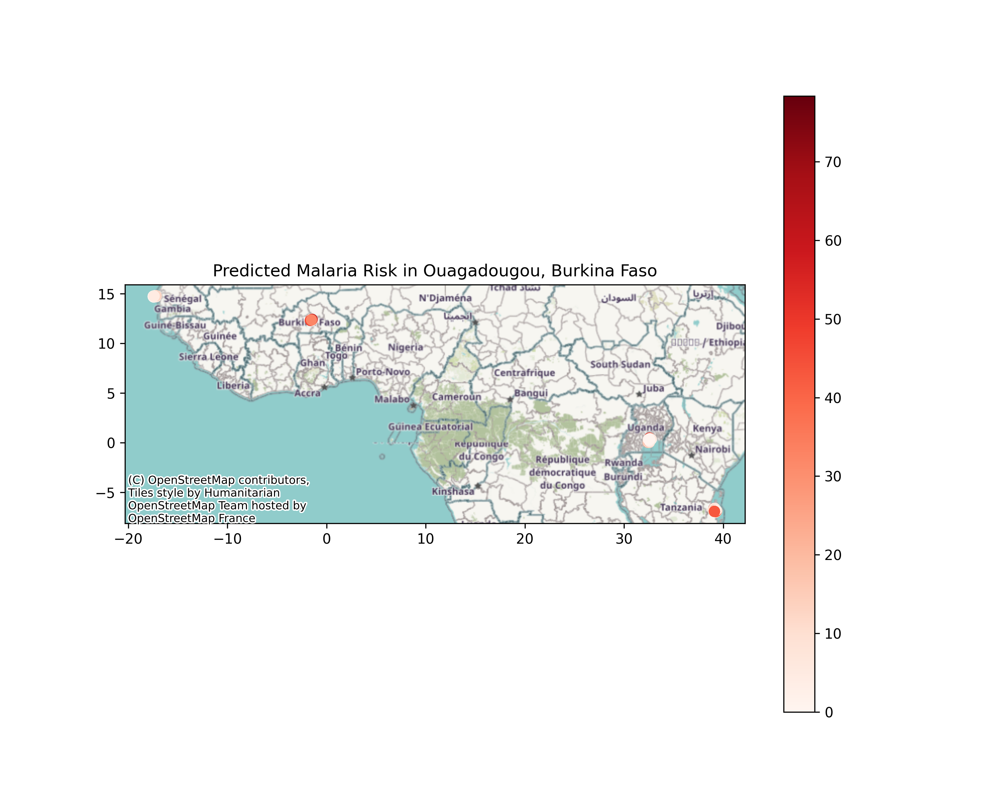

# Predictive Modelling of Urban Malaria Risk Using Spatial-Temporal Survey and Environmental Data — Burkina Faso



## Table of Contents

- [Project Overview](#project-overview)  
- [Author](#author)
- [Data](#data)  
- [Methods](#methods)  
- [Machine Learning Models](#machine-learning-models)  
- [Model Evaluation](#model-evaluation)  
- [Spatial Analysis](#spatial-analysis)  
- [Results](#results)  
- [Folder Structure](#folder-structure)  
- [Getting Started](#getting-started)  
- [Requirements](#requirements)  
- [References](#references)  
- [License](#license)

---

## Project Overview

Malaria remains a major public health concern in Burkina Faso. This project aims to predict urban malaria prevalence using a combination of spatial-temporal survey data and environmental covariates. By integrating Random Forest and XGBoost models with geospatial analysis, we identify hotspots of malaria risk in Ouagadougou and highlight key environmental drivers.  

**Impact:** This work demonstrates actionable modeling for public health interventions in low- and middle-income countries (LMICs).

---

## Data

The project uses malaria prevalence survey data and environmental variables for Burkina Faso:

**Source:** Survey data for Ouagadougou, Burkina Faso  

**Variables:**
- Geographic coordinates: **LAT**, **LONG**
- **Year**, **Month**
- **Vegetation Index (EVI)**
- **Temperature Suitability Index (TSI)**
- **Precipitation (PRES_N, PRES_MM)**
- **Season (SEASON_Wet123)**
- **PfPR2_10** — Plasmodium falciparum prevalence in children 2–10 years

> ** Note:** Sensitive or restricted datasets are stored locally in `data/raw/` and are not included in the repository.

---

## Methods

### Data Preprocessing
- Handle missing values for environmental covariates using **median imputation**
- Convert categorical and seasonal variables to numeric format
- Filter out rows with missing target variable

### Train-Test Split
```python
from sklearn.model_selection import train_test_split

X_train, X_test, y_train, y_test = train_test_split(
    X, y, 
    test_size=0.2, 
    random_state=42
)
```

---

## Machine Learning Models

### Random Forest Regressor

```python
from sklearn.ensemble import RandomForestRegressor

rf = RandomForestRegressor(
    n_estimators=200, 
    max_depth=10, 
    random_state=42
)
rf.fit(X_train, y_train)
```

### XGBoost Regressor

```python
from xgboost import XGBRegressor

xgb = XGBRegressor(
    n_estimators=200, 
    max_depth=5, 
    learning_rate=0.1, 
    random_state=42
)
xgb.fit(X_train, y_train)
```

---

## Model Evaluation

- **Metrics:** RMSE, R² Score
- **Residual Analysis:** Check for bias and systematic errors in predictions
- **Feature Importance:** Visualize key drivers of malaria risk

---

## Spatial Analysis

- Convert predictions to GeoDataFrame using **geopandas**
- Generate malaria risk maps to visualize hotspots across Ouagadougou
- Integrate contextual maps using **contextily** for geographic reference

---

## Results

### Random Forest Performance
| Metric | Value |
|--------|-------|
| RMSE | 11.38 |
| R² Score | 0.38 |

### XGBoost Performance
| Metric | Value |
|--------|-------|
| RMSE | 10.92 |
| R² Score | 0.42 |

### Key Drivers of Malaria Risk

1. **Vegetation Index (EVI)** — Environmental vegetation coverage
2. **Seasonality** — Seasonal patterns affecting malaria transmission
3. **Temperature Suitability Index (TSI)** — Temperature-dependent malaria vector development

### Spatial Hotspots

**High-risk zones** identified in central and northern districts of Ouagadougou

> ** Output Files:** Maps and CSV predictions are available in the `outputs/` folder.

---

## Folder Structure

```
urban-malaria-risk-burkina-faso/
│
├── README.md                              # Project documentation
├── LICENSE                                # MIT License
├── requirements.txt                       # Python dependencies
│
├── data/
│   └── burkina_malaria_data.csv          # Original survey data
│
├── notebooks/
│   └── urban_malaria_prediction_burkina_faso.ipynb
│
├── models/                                # Saved trained models
│   ├── random_forest_model.pkl
│   └── xgboost_model.pkl
│
├── Images/                                # Plots and geographic maps
│   ├── feature_importance.png
│   └── malaria_risk_map.png
│
└── outputs/                               # Final outputs for reports
    └── predicted_malaria_risk.csv
```

---

## Getting Started

### 1. Clone the Repository

```bash
git clone https://github.com/Geu-Pro2023/urban_malaria_risk_burkina_faso.git
cd urban-malaria-risk-burkina-faso
```

### 2. Create and Activate Virtual Environment

```bash
python -m venv venv

# On macOS/Linux:
source venv/bin/activate

# On Windows:
venv\Scripts\activate
```

### 3. Install Dependencies

```bash
pip install -r requirements.txt
```

### 4. Run the Jupyter Notebook

```bash
jupyter notebook notebooks/urban_malaria_prediction_burkina_faso.ipynb
```

---

## Requirements

- **Python:** 3.9 or higher
- **Data Science:**
  - pandas
  - numpy
  - scikit-learn
  - xgboost
- **Visualization:**
  - matplotlib
  - seaborn
- **Geospatial Analysis:**
  - geopandas
  - contextily

For detailed versions, see `requirements.txt`.

---
## Author

**Geu Aguto Garang Bior**  
*Software Engineering Student – Machine Learning | Health Mission Student*

## References

- Baragatti, M., et al. (2009). Malaria prevalence survey data, Burkina Faso.
- WHO. (2022). World Malaria Report 2022. https://www.who.int/publications/i/item/9789240064898
- Scikit-learn Documentation: https://scikit-learn.org
- XGBoost Documentation: https://xgboost.readthedocs.io
- Geopandas Documentation: https://geopandas.org

---

## License

This project is licensed under the **MIT License** – see the [LICENSE](LICENSE) file for details.

---

**Last Updated:** January 3, 2026
